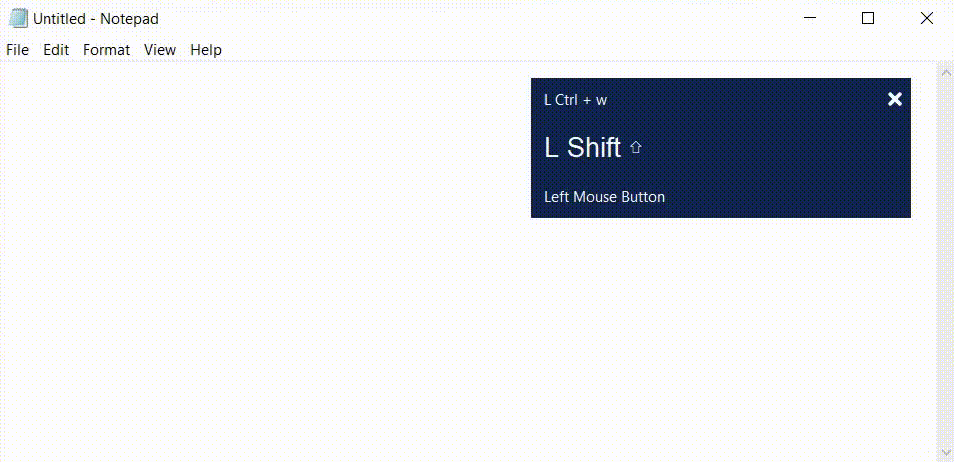
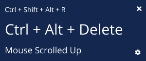
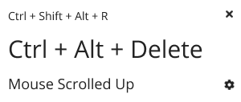
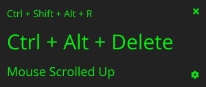

<link rel="stylesheet" href="https://cdnjs.cloudflare.com/ajax/libs/font-awesome/5.15.4/css/all.min.css" integrity="sha512-1ycn6IcaQQ40/MKBW2W4Rhis/DbILU74C1vSrLJxCq57o941Ym01SwNsOMqvEBFlcgUa6xLiPY/NS5R+E6ztJQ==" crossorigin="anonymous" referrerpolicy="no-referrer" />

[](https://svgshare.com/i/Zhy.svg)
[](https://svgshare.com/i/ZhY.svg)
[](https://svgshare.com/i/ZjP.svg)
[](https://www.python.org/)
[](https://pypi.python.org/pypi/ansicolortags/)

<br/>

<p align="center">
  <a href="https://github.com/daxter-army/key-cast/">
    
  </a>

  <h3 align="center">Key Cast</h3>

  <p align="center">
    Screen cast your keyboard and mouse clicks in style
    <br />
    <a href="https://daxter-army.github.io/key-cast/"><strong>Project Homepage »</strong></a>
    <br />
    <br />
    <a href="https://daxter-army.github.io/key-cast/">View Demo</a>
    ·
    <a href="https://daxter-army.github.io/key-cast/issues">Report Bug</a>
    ·
    <a href="https://daxter-army.github.io/key-cast/issues">Request Feature</a>
  </p>
</p>

<details open="open">
  <summary>Table of Contents</summary>
  <ol>
    <li>
      <a href="#about-the-project">Introduction</a>
      <a href="#functionalities">Functionalities</a>
      <ul>
        <li><a href="#built-with">Built With</a></li>
      </ul>
    </li>
    <li>
      <a href="#getting-started">Getting Started</a>
      <a href="#getting-started">Getting Started (Development)</a>
      <ul>
        <li><a href="#prerequisites">Prerequisites</a></li>
        <li><a href="#installation">Installation</a></li>
        <li><a href="#building">Building</a></li>
      </ul>
    </li>
    <li><a href="#usage">Usage</a></li>
    <!-- <li><a href="#roadmap">Roadmap</a></li> -->
    <!-- <li><a href="#contributing">Contributing</a></li> -->
    <li><a href="#license">License</a></li>
    <li><a href="#contact">Contact</a></li>
    <li><a href="#acknowledgement">Acknowledgement</a></li>
    <li><a href="#info">Info</a></li>
    <li><a href="#issues">Issues</a></li>
  </ol>
</details>

<!-- ABOUT THE PROJECT -->

## ✨ Introduction

<p align="center">

</p>

In this internet age, everyone is learning to stay ahead in their career or to develop something new, creative and fun. Digging the internet for quality tutorials, watching that youtube videos of blender, illustrator, photoshop, webdev and what not. To give back to your community, you also thought of creating some tutorials, but guess what, you are not having any good keyboard and mouse indicators, and that ones which are available in the market, do not suits your personality.
<br/><br/>
Here comes **Keycast**, which enables you to, screen cast your keyboard and mouse clicks, while also being pleasant to your eyes and why you should consider Keycast, here's why:

- **Cross-platform:** Run it anywhere. Run it on Linux, Windows or OS X.
- **Keybaord & mouse clicks:** From keyboard presses to mouse clicks, we've covered you all!.
- **Drag it anywhere:** Obstructing your view? place it anywhere on the screen.
- **Show in style:** Choose from numerous themes, or create your own.
- **Transparency control:** Adjust the transparency level of the panel as per your convenience.

## 🌠 Functionalities
* Following are the functionalities implemented till now:
* Show previous and current keypresses/key combinations
* Show mouse activity
* Drag and drop anywhere on the screen
* Various themes
* Adjust the transparency level of the window

### 🛠 Built With

This was achieved with **Python** (cPython), with **Pynput** as global keyboard and mouse event listener, **Tkinter** powering the GUI, & **Pyinstaller** for creating distributable package files.

- [Python](https://python.org)
- [Tkinter](https://docs.python.org/3/library/tkinter.html)
- [Pynput](https://pypi.org/project/pynput/)
- [Pyinstaller](https://pyinstaller.readthedocs.io/en/stable/)

<!-- GETTING STARTED -->

## 🏎 Getting Started

- You do not need Python installed to use this app, just go to the application [Homepage](https://daxter-army.github.io/key-cast), and download the package as per your OS.

**For Linux/OS X users only**

- After downloading the file, open the properties of the file, go to permissions tab and check the option saying **allow executing file as program**, and then run the file, now it would run smoothly.

## 🚲 Getting Started (Development)

This section will help you to get started with the project, locally

## 🗜 Prerequistes

- You should be having Python version > 3.6.x
- Install the requirements from **REQUIREMENTS.txt** file via **pip** before actually running the application, with

```python
    pip3 install -r REQUIREMENTS.txt
```

### 🐱‍🏍 Installation

- Clone the project locally with

```sh
    git clone git@github.com:daxter-army/key-cast.git
```

- Navigate to the project dir and activate virtual env
- _for windows_

```sh
    .\keycast_env\bin\activate
```

- _for linux/OS X_

```sh
    source .\keycast_env\bin\activate
```

- Now you'll see that virtual env has been activated, after this hit

```sh
    python3 keycast_dev.py
```

- You have done it, you will be seeing a window running on your screen, if everything goes well.

### 🧪 Building

To create one distributable file on linux/OS X, type

```sh
    pyinstaller keycast_prod.py --onefile -i "path_to_icon/icon_file.ico" --add-data "assets:assets"
```

With hidden console window, in Windows, type

```sh
    pyinstaller keycast_prod.py --onefile -i "path_to_icon/icon_file.ico" --add-data "assets;assets" --windowed
```

With console window in the background, in Windows, remove **--windowed** argument

<!-- USAGE EXAMPLES -->

## 🥏 Usage

<p align="center">
  
  
  
</p>

* You can use it with any of your favourite software while making any tutorial, screen casting your screen, or while streaming your game over the internet.
* Choose any of the style that suits your mood, and flex in your way. 😎

<!-- CONTRIBUTING -->
<!-- ## Contributing

Contributions are what make the open source community such an amazing place to learn, inspire, and create. Any contributions you make are **greatly appreciated**.

1. Fork the Project
2. Create your Feature Branch (`git checkout -b feature/AmazingFeature`)
3. Commit your Changes (`git commit -m 'Add some AmazingFeature'`)
4. Push to the Branch (`git push origin feature/AmazingFeature`)
5. Open a Pull Request -->

<!-- LICENSE -->

## 🗄 License

Distributed under the MIT License. See `LICENSE` for more information.

<!-- CONTACT -->

## 📱 Contact

Mehul Singh Teya - mehulsinghteya@gmail.com | [LinkedIn](https://linkedin.com/in/mehulsinghteya)
<br/>
Project Link: [https://github.com/daxter-army/key-cast](https://github.com/daxter-army/key-cast)
<br/>
Project Homepage : [https://daxter-army.github.io/key-cast](https://daxter-army.github.io/key-cast)

## 🙏 Acknowledgement

- [Fontawesome](https://fontawesome.com)
- [Python](https://python.org)
- [Tkinter](https://docs.python.org/3/library/tkinter.html)
- [Pynput](https://pypi.org/project/pynput/)
- [Pyinstaller](https://pyinstaller.readthedocs.io/en/stable/)

## ℹ Info

- Right now it is heavily under development, and is being developed in linux (ubuntu). You can see unidentified characters being shown by the software, because sometimes different key combos having different key codes, I am working on this to support as many as keyboards and key combos possible.

- **windows_bundle** directory contains bundled package for windows, same is the case with **linux_bundle**, bundle to be created for mac OS X.

- The main file that runs is **/dist/keycast_prod.exe**, these are also the files that are available on the homepage to be downloaded.

- For development use, **keycast_dev.py**, then copy-paste the whole code to **keycast_prod.py**, and also paste the code of additional files in that file also, to increase the performance.

## 🐞 Issues

Visit Issues tab
<br/>
<a href="https://github.com/daxter-army/key-cast/issues">Issues</a>
